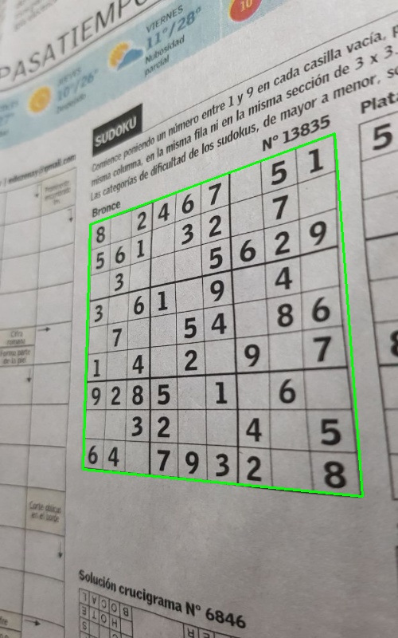
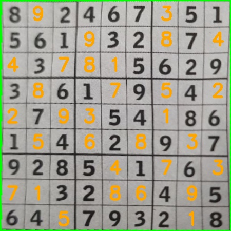

# PhotoSudokuSolver

**¡Toma una foto a cualquier Sudoku y lo resuelve en menos de 1 segundo!**  
Funciona con periódicos, libros, pantallas de móvil/ordenador, papel arrugado y ángulos difíciles.

## Características

- Detección automática del tablero (incluso con perspectiva fuerte)
- Corrección de perspectiva y recorte perfecto
- Extracción y limpieza de las 81 celdas
- Reconocimiento de dígitos con red neuronal propia (CNN 50×50 entrenada en PyTorch)
- Solver exacto con propagación de restricciones + backtracking
- Dibuja la solución directamente sobre la imagen original
- Inferencia ultrarrápida: **~0.4 segundos en CPU** para las 81 celdas

## Demo en acción

| Foto original | Solución superpuesta |
|---------------|----------------------|
|  |  |

*(Para probar usar imagenes dentro de carpeta  `/data`)*

## Instalación (3 comandos)

git clone https://github.com/eleazarheviat/PhotoSudokuSolver.git
cd PhotoSudokuSolver
pip install -r requirements.txt

## Requisitos
- Python 3.8+
- numpy
- matplotlib
- OpenCV
- scikit-learn
- torch (PyTorch)
- torchvision

## Uso rápido

python src/main.py "ruta/a/tu/foto_sudoku.jpg"

## Estructura del Proyecto

PhotoSudokuSolver/
├── src/                           ← Código principal
├── models/                    ← Modelo PyTorch pre-entrenado
├── training/                   ← Notebook de entrenamiento + dataset completo
├── data/samples/          ← Imágenes de prueba
├── results/                     ← Ejemplos de resultados (antes/después)
├── requirements.txt
└── README.md

## Próximos pasos:

- Filtros anti-reflejos y anti-arrugas (CLAHE + denoising)
- Interfaz web con Streamlit
- App móvil (exportar modelo a ONNX/TFLite)
- Dataset público de sudokus reales etiquetados

## Conclusiones

Con la red neuronal convolucional entrenada con el set de datos `test_synthetic` se alcanzó un **accuracy superior al 98 %**, lo cual permite clasificar correctamente los números detectados en las celdas de sudokus reales en menos de un segundo.

El sistema completo demuestra ser robusto frente a fotos tomadas en condiciones cotidianas: periódicos, libros, pantallas de ordenador o móvil, papel arrugado y ángulos inclinados. Gracias a la combinación de OpenCV para la corrección de perspectiva y extracción de celdas, junto con la CNN propia en PyTorch, el solver resuelve la gran mayoría de sudokus de manera automática y sin intervención manual.

Este proyecto no solo resuelve sudokus de forma práctica, sino que también sirve como ejemplo real de un pipeline completo de visión por computadora + deep learning aplicado a un problema del día a día.
## Autor
- Lazar (@eleazarheviat)
- Contacto: eheviatorres@gmail.com

## Licencia
- **Código del notebook**: Licencia MIT © [Lazar/2025]

